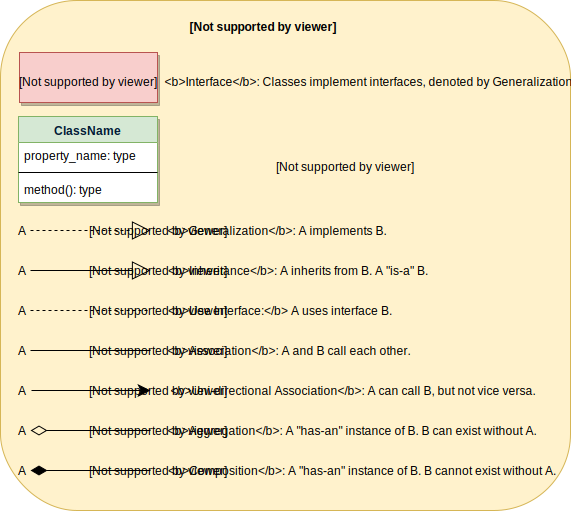
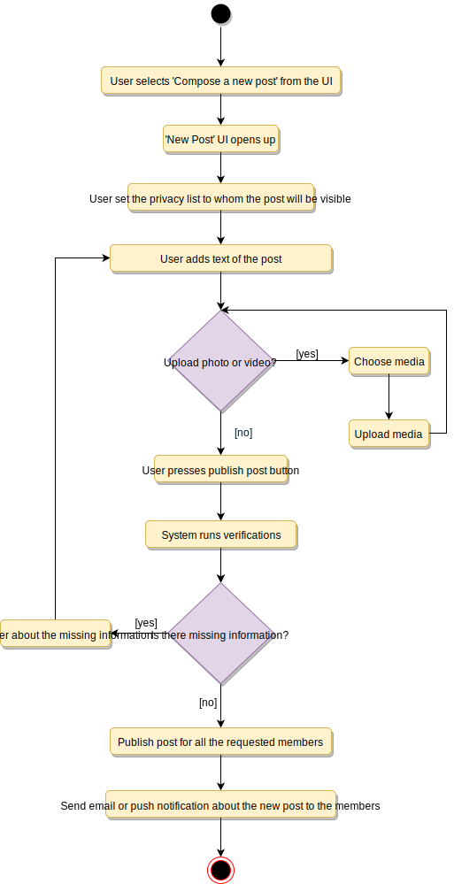

# Design Facebook - a social network
### Let's design Facebook - a social network

**We'll cover the following:**

* [System Requirements](#system-requirements)
* [Use Case Diagram](#use-case-diagram)
* [Class Diagram](#class-diagram)
* [Activity Diagrams](#activity-diagrams)
* [Code](#code)
* [Extended Requirement](#extended-requirement)

Facebook is an online social networking service where users can connect with other users to post and read messages. Users access Facebook through their website interface or mobile apps.


*Facebook*

### System Requirements

We will focus on the following set of requirements while designing Facebook:

1. Each member should be able to add information about their basic profile, work experience, education, etc.
2. Any user of our system should be able to search other members, groups or pages by their name.
3. Members should be able to send and accept/reject friend requests from other members.
4. Members should be able to follow other members without becoming their friend.
5. Members should be able to create groups and pages, as well as join already created groups, and follow pages.
6. Members should be able to create new posts to share with their friends.
7. Members should be able to add comments to posts, as well as like or share a post or comment.
8. Members should be able to create privacy lists containing their friends. Members can link any post with a privacy list to make the post visible only to the members of that list.
9. Any member should be able to send messages to other members.
10. Any member should be able to add a recommendation for any page.
11. The system should send a notification to a member whenever there is a new message or friend request or comment on their post.
12. Members should be able to search through posts for a word.

**Extended Requirement:** Write a function to find a connection suggestion for a member.

### Use Case Diagram

We have three main Actors in our system:

* **Member:** All members can search for other members, groups, pages, or posts, as well as send friend requests, create posts, etc.
* **Admin:** Mainly responsible for admin functions like blocking and unblocking a member, etc.
* **System:** Mainly responsible for sending notifications for new messages, friend requests, etc.

Here are the top use cases of our system:

* **Add/update profile:** Any member should be able to create their profile to reflect their work experiences, education, etc.
* **Search:** Members can search for other members, groups or pages. Members can send a friend request to other members.
* **Follow or Unfollow a member or a page:** Any member can follow or unfollow any other member or page.
* **Send message:** Any member can send a message to any of their friends.
* **Create post:** Any member can create a post to share with their friends, as well as like or add comments to any post visible to them.
* **Send notification:** The system will be able to send notifications for new messages, friend requests, etc.

Here is the use case diagram of Facebook:


*Use Case Diagram for Facebook*

### Class Diagram

Here are the main classes of the Facebook system:

* **Member:** This will be the main component of our system. Each member will have a profile which includes their Work Experiences, Education, etc. Members will be connected to other members and they can follow other members and pages. Members will also have suggestions to send friend requests to other members.
* **Search:** Our system will support searching for other members, groups and pages by their names, and through posts for any word.
* **Message:** Members can send messages to other members with text, photos, and videos.
* **Post:** Members can create posts containing text and media, as well as like and share a post.
* **Comment:** Members can add comments to posts as well as like any comment.
* **Group:** Members can create and join groups.
* **PrivacyList:** Members can create privacy lists containing their friends. Members can link any post with a privacy list, to make the post visible only to the members of that list.
* **Page:** Members can create pages that other members can follow, and share messages there.
* **Notification:** This class will take care of sending notifications to members. The system will be able to send a push notification or an email.


*Class Diagram for Facebook*



*UML for Facebook*

### Activity Diagrams

**Add work experience to profile:** Any Facebook member can perform this activity. Here are the steps to add work experience to a member’s profile:


*Activity Diagram for Facebook Add Experience to Profile*

**Create a new post:** Any Member can perform this activity. Here are the steps for creating a post:



*Activity Diagram for Facebook Create New Post*

### Code

Here is the high-level definition for the classes described above.

**Enums, data types, and constants:** Here are the required enums, data types, and constants:

```python
from enum import Enum


class ConnectionInvitationStatus(Enum):
    PENDING, ACCEPTED, REJECTED, CANCELED = 1, 2, 3, 4


class AccountStatus(Enum):
    ACTIVE, CLOSED, CANCELED, BLACKLISTED, DISABLED = 1, 2, 3, 4, 5


class Address:
    def __init__(self, street, city, state, zip_code, country):
        self.__street_address = street
        self.__city = city
        self.__state = state
        self.__zip_code = zip_code
        self.__country = country

```

**Account, Person, Member, and Admin:** These classes represent the different people that interact with our system:

```python
from abc import ABC
from datetime import datetime
from .constants import AccountStatus, ConnectionInvitationStatus
from .profile import Profile


# For simplicity, we are not defining getter and setter functions. The reader can
# assume that all class attributes are private and accessed through their respective
# public getter methods and modified only through their public methods function.

class Account:
    def __init__(self, id, password, status=AccountStatus.Active):
        self.__id = id
        self.__password = password
        self.__status = status

    def reset_password(self):
        None


# from abc import ABC, abstractmethod
class Person(ABC):
    def __init__(self, name, address, email, phone, account):
        self.__name = name
        self.__address = address
        self.__email = email
        self.__phone = phone
        self.__account = account


class Member(Person):
    def __init__(self, id, date_of_membership, name):
        self.__member_id = id
        self.__date_of_membership = date_of_membership
        self.__name = name

        self.__profile = Profile()
        self.__member_follows = []
        self.__member_connections = []
        self.__page_follows = []
        self.__member_suggestions = []
        self.__connection_invitations = []
        self.__group_follows = []

    def send_message(self, message):
        None

    def create_post(self, post):
        None

    def send_connection_invitation(self, invitation):
        None

    def search_member_suggestions(self):
        None


class Admin(Person):
    def block_user(self, customer):
        None

    def unblock_user(self, customer):
        None

    def enable_page(self, page):
        None

    def disable_page(self, page):
        None


class ConnectionInvitation:
    def __init__(self, member_invited, name, status=ConnectionInvitationStatus.PENDING):
        self.__member_invited = member_invited
        self.__status = status
        self.__date_created = datetime.date.today()
        self.__date_updated = datetime.date.today()

    def accept_connection(self):
        None

    def reject_connection(self):
        None

```

**Profile and Work:** A member’s profile will have their work experiences, educations, places, etc:

<div class="example-code">
<h4>Profile Class</h4>

```python
class Profile:
    def __init__(self, profile_picture, cover_photo, gender):
        self.__profile_picture = profile_picture
        self.__cover_photo = cover_photo
        self.__gender = gender

        self.__work_experiences = []
        self.__educations = []
        self.__places = []
        self.__stats = []

    def add_work_experience(self, work):
        None

    def add_education(self, education):
        None

    def add_place(self, place):
        None


class Work:
    def __init__(self, title, company, location, date_from, date_to, description):
        self.__title = title
        self.__company = company
        self.__location = location
        self.__from = date_from
        self.__to = date_to
        self.__description = description


```
</div>

**Page and Recommendation:** Each page can have multiple recommendations, and members will follow/like pages:

```python
from datetime import datetime


class Page:
    def __init__(self, id, name, description, type, total_members):
        self.__page_id = id
        self.__name = name
        self.__description = description
        self.__type = type
        self.__total_members = total_members
        self.__recommendation = []

    def get_recommendation(self):
        return self.__recommendation


class Recommendation:
    def __init__(self, id, rating, description):
        self.__recommendation_id = id
        self.__rating = rating
        self.__description = description
        self.__created_at = datetime.date.today()

```

**Group, Post, Message, and Comment:** Members can create posts, comment on posts, send messages and join groups:

<div class="example-code">
<h4>Group Class</h4>

```python
class Group:
    def __init__(self, id, name, description, total_members):
        self.__group_id = id
        self.__name = name
        self.__description = description
        self.__total_members = total_members
        self.__members = []

    def add_member(self, member):
        None

    def update_description(self, description):
        None


class Post:
    def __init__(self, id, text, total_likes, total_shares, owner):
        self.__post_id = id
        self.__text = text
        self.__total_likes = total_likes
        self.__total_shares = total_shares
        self.__owner = owner


class Message:
    def __init__(self, id, sent_to, body, media):
        self.__message_id = id
        self.__sent_to = sent_to
        self.__message_body = body
        self.__media = media

    def add_member(self, member):
        None


class Comment:
    def __init__(self, id, text, total_likes, owner):
        self.__comment_id = id
        self.__text = text
        self.__total_likes = total_likes
        self.__owner = owner


```
</div>

**Search interface and SearchIndex:** SearchIndex will implement Search to facilitate searching of members, groups, pages, and posts:

```python
from abc import ABC


class Search(ABC):
    def search_member(self, name):
        None

    def search_group(self, name):
        None

    def search_page(self, name):
        None

    def search_post(self, word):
        None


class SearchIndex(Search):
    def __init__(self):
        self.__member_names = {}
        self.__group_names = {}
        self.__page_titles = {}
        self.__posts = {}

    def add_member(self, member):
        if member.get_name() in self.__member_names:
            self.__member_names.get(member.get_name()).add(member)
        else:
            self.__member_names[member.get_name()] = member

    def add_group(self, group):
        None

    def add_page(self, page):
        None

    def add_post(self, post):
        None

    def search_member(self, name):
        return self.__member_names.get(name)

    def search_group(self, name):
        return self.__group_names.get(name)

    def search_page(self, name):
        return self.__page_titles.get(name)

    def search_post(self, word):
        return self.__posts.get(word)

```

### Extended Requirement

Let's try to write code for finding connection suggestions for a member.

There can be many strategies to search for connection suggestions; we will do a two-level deep breadth-first search to find people who have the most connections with each other. These people could be good candidates for a connection suggestion.

Let's try to write a the sample code:

```python
# This section is for practicing this code

```
