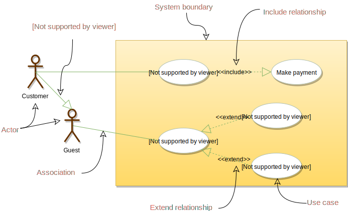

# Use Case Diagrams

Use case diagrams describe a set of actions (called use cases) that a system should or can perform in collaboration with one or more external users of the system (called actors). Each use case should provide some observable and valuable result to the actors.

1. Use Case Diagrams describe the high-level functional behavior of the system.
2. It answers what system does from the user point of view.
3. Use case answers ‘What will the system do?’ and at the same time tells us ‘What will the system NOT do?’.

A use case illustrates a unit of functionality provided by the system. The primary purpose of the use case diagram is to help development teams visualize the functional requirements of a system, including the relationship of “actors” to the essential processes, as well as the relationships among different use cases.

To illustrate a use case on a use case diagram, we draw an oval in the middle of the diagram and put the name of the use case in the center of the oval. To show an actor (indicating a system user) on a use-case diagram, we draw a stick figure to the left or right of the diagram.

*Sample use-case diagram for online shopping system*

The different components of the use case diagram are:

**System Boundary:** A system boundary defines the scope and limits of the system. It is shown as a rectangle that spans all use cases of the system.

**Actors:** An actor is an entity who performs specific actions. These roles are the actual business roles of the users in a given system. An actor interacts with a use case of the system. For example, in a banking system, the customer is one of the actors.

**Use Case:** Every business functionality is a potential use case. The use case should list the discrete business functionality specified in the problem statement.

**Include:** Include relationship represents an invocation of one use case by another use case. From a coding perspective, it is like one function being called by another function.

**Extend:** This relationship signifies that the extended use case will work exactly like the base use case, except that some new steps will be inserted in the extended use case.